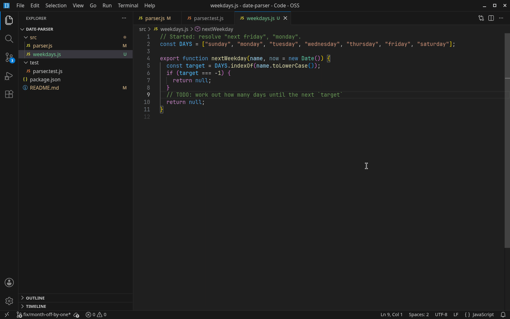
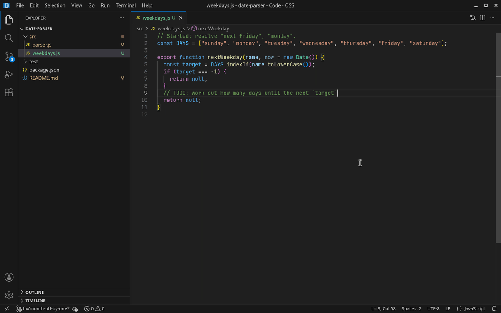
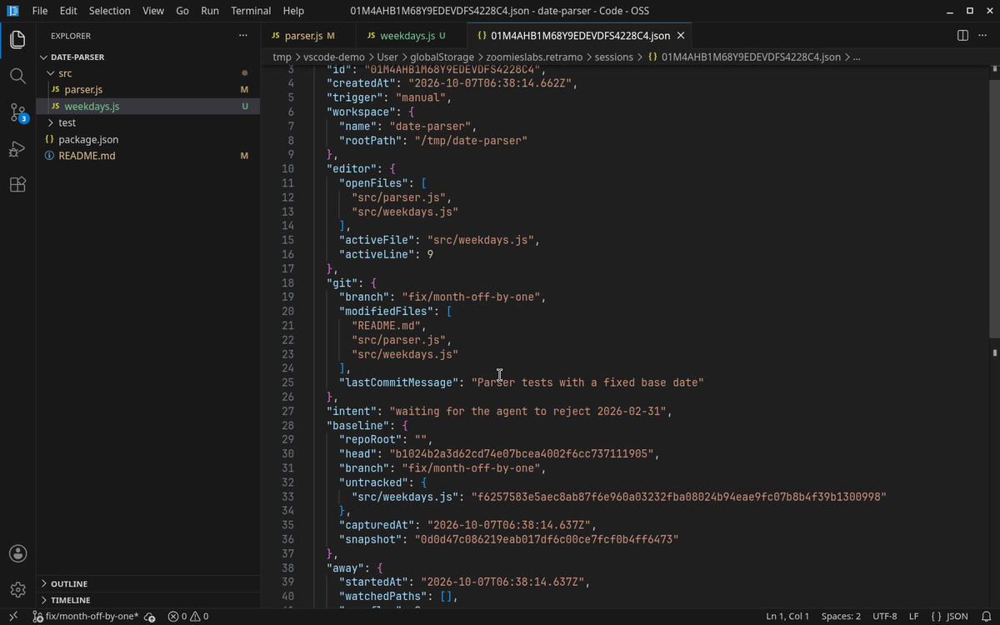

# Retramo

When you come back after an interruption, Retramo tells you three things: what you were in the middle of, what changed while you were away, and what to review first.

It's made for people with ADHD, and for anyone who works alongside AI agents. Your agent remembers its own session; nothing remembers *yours*. Retramo does, and it doesn't care who changed the code: Copilot, Claude Code, Cursor's agent, a teammate or a `git pull`.

Two actions, no setup to get started, and everything stays on your machine.



## Two actions

| Action | Command | Shortcut |
|---|---|---|
| **I'm leaving** | `Retramo: I'm leaving` | `Ctrl+Alt+L` (`Cmd+Alt+L` on Mac) |
| **I'm back** | `Retramo: I'm back` | `Ctrl+Alt+R` (`Cmd+Alt+R` on Mac) |

**I'm leaving** asks *"What were you in the middle of?"* (optional, up to 200 characters; press Enter with no text to skip), snapshots the state of your repository, and saves the session.

**I'm back** opens a panel next to the editor, in this order:

1. **You were in the middle of**: what you wrote, in large type.
2. **While you were away**: branch changes, new commits with their authors, and every file that changed. Click a file to see a diff of *only what changed since you left*, not what you already had uncommitted.
3. An AI summary, if you set one up.
4. The active file and line, as a link.
5. What you had uncommitted when you left.
6. The git branch.
7. Recent terminal commands.
8. Open files (collapsed).

You don't have to remember to press anything. If you go 20 minutes without doing anything, Retramo saves a session on its own. When you come back, a single item appears in the status bar, for example `Retramo: 4 changes while you were away`. Click it to open the panel. Retramo never opens the panel by itself, and there are no popups.

Secondary commands:

- `Retramo: History` — pick from your last 20 sessions.
- `Retramo: Open data folder` — opens the folder with the JSON files, so you can see exactly what was saved.
- `Retramo: Set API key for summaries` — only if you want summaries from OpenAI or Anthropic.

The interface follows VS Code's display language: English by default, Spanish if your VS Code is in Spanish.

## How "while you were away" works

**Only you count as you.** An agent editing files, a formatter or a `git pull` doesn't make Retramo think you're at your desk. Typing, moving the cursor, clicking, scrolling, focusing the window and typing in the terminal all count, including chatting with an agent like Claude Code inside VS Code's terminal. Edits made by extensions or by programs outside VS Code don't.

**A snapshot when you leave.** Retramo records your `HEAD`, your branch, and a snapshot of your uncommitted work with `git stash create`. That command doesn't touch your working tree, your index or your stash list. It only writes unreferenced objects into `.git`, which git cleans up on its own. Untracked files are recorded as SHA-256 hashes, never their contents.

When the automatic capture kicks in, the snapshot is the one taken a couple of minutes after you stopped, not the one 20 minutes later. That way, everything your agent did in the meantime still shows up as a change.



**Coming back.** Retramo compares the repository against that snapshot: new commits, changed tracked files, new or changed untracked files, plus any file the editor saw change. Retramo never modifies your repository.

If the snapshot was garbage-collected (`git gc`) during a long absence, Retramo compares against your last commit and says so. If the branch history was rewritten (rebase or reset), it says that instead of listing commits that don't make sense.

## What gets saved

Each session is a readable JSON file, one per session, in VS Code's global storage folder. It looks like this:

```json
{
  "schemaVersion": 2,
  "id": "01J9X4M3V9K2Q4R8T7W1Z5B6C7",
  "createdAt": "2026-10-06T14:03:00.000Z",
  "trigger": "manual",
  "intent": "waiting for the agent to fix the login test",
  "workspace": { "name": "my-app", "rootPath": "/home/me/my-app" },
  "editor": {
    "activeFile": "src/auth/login.ts",
    "activeLine": 42,
    "openFiles": ["src/auth/login.ts", "test/login.test.ts"]
  },
  "git": {
    "branch": "fix/login-token",
    "modifiedFiles": ["src/auth/login.ts"],
    "lastCommitMessage": "wip: refresh token"
  },
  "terminal": { "recentCommands": ["npm test -- login"], "cwd": "/home/me/my-app" },
  "baseline": {
    "repoRoot": "",
    "head": "3f2a9c...",
    "branch": "fix/login-token",
    "snapshot": "c88ca7...",
    "untracked": { "notes.md": "9f86d081884c7d65..." },
    "capturedAt": "2026-10-06T14:03:00.000Z"
  },
  "away": {
    "startedAt": "2026-10-06T14:03:00.000Z",
    "watchedPaths": ["src/auth/login.ts", "test/login.test.ts"],
    "overflow": 0,
    "endedAt": "2026-10-06T14:50:00.000Z"
  }
}
```

This is a real session file, opened in VS Code:



**File contents and diffs are never saved.** The session only holds paths relative to the workspace, positions, commit hashes and SHA-256 hashes of untracked files. The one place your uncommitted work is copied to is the `git stash create` snapshot, which lives in your own repository's `.git` folder and never leaves your machine.

Terminal commands are recorded as you run them, without their output.

## Local by default

Nothing leaves your machine unless you explicitly turn it on. No telemetry, no content, no keys. There are exactly two things that can leave, and both are opt-in:

### 1. AI summary (optional)

If you set `retramo.summary.provider` to `openai`, `anthropic` or `ollama`, opening **I'm back** generates a two-or-three-sentence summary. The panel shows everything else first and the summary arrives afterwards, without blocking anything.

**What gets sent** is built field by field, inside the prompt in [`prompts/summary.txt`](prompts/summary.txt):

- what you were in the middle of
- the workspace name, your active file and line, your open files
- your branch, the files you had uncommitted, your last commit message
- your recent terminal commands
- while you were away: how long, branch changes, new commits (subject and author), changed files (path and status)

**What never gets sent:** file contents, the snapshot, commit hashes, the hashes of your untracked files, absolute paths, or session ids.

The summary isn't generated for a session from a different project that you didn't pick yourself. That happens when you press **I'm back** in a folder with no sessions of its own.

- `openai` and `anthropic` use your own key. It's stored in VS Code's secret storage (`context.secrets`), never in `settings.json`. Set it with `Retramo: Set API key for summaries`. With `anthropic`, a request declined by a safety classifier is retried server-side on the fallback model Anthropic recommends for that case.
- `ollama` uses the endpoint in `retramo.summary.ollamaEndpoint` (default `http://localhost:11434`) and the first model you have installed. Nothing leaves your network.

With no key configured and no local endpoint, the option doesn't exist: nothing is shown.

**Sending code is a separate opt-in.** With `retramo.summary.includeDiffs`, the summary also gets the diff of the files that changed while you were away. That diff is truncated at 20,000 characters and excludes deleted files and anything that looks like a secret (`.env*`, `*.pem`, `*.key`, SSH keys, files with "credential" or "secret" in the name). The first time you turn it on, Retramo asks you to confirm; if you don't, it switches back off.

### 2. Telemetry (optional, off by default)

The first time it starts, Retramo asks once: *"Can we count how many times a week you use “I'm back”? Just the number, nothing else."* Closing the prompt counts as No.

If you say yes, once a week **exactly this** is sent, and nothing else:

```json
{ "installId": "<random uuid>", "returnCount": 12, "version": "0.2.0" }
```

You can change it at any time with `retramo.telemetry`. VS Code's `telemetry.telemetryLevel` is respected too: if it's set to `off`, nothing is sent even if you said yes.

It's sent via `POST` to `https://retramo-telemetry.netlify.app/ping`. The server stores only those three fields, grouped by week; it doesn't store your IP or anything else. Its code is in [`server/telemetry/`](server/telemetry/).

## Settings

This is all there is:

```json
{
  "retramo.idleMinutes": 20,
  "retramo.away.exclude": [],
  "retramo.summary.provider": "none",
  "retramo.summary.includeDiffs": false,
  "retramo.summary.ollamaEndpoint": "http://localhost:11434",
  "retramo.telemetry": false
}
```

- `retramo.idleMinutes` has a minimum of 5.
- `retramo.away.exclude` takes glob patterns, such as `**/*.log`, that are left out of the "while you were away" list. `.git`, `node_modules`, `dist`, `build`, `out`, `.next` and `target` are always left out. Changes git sees are still reported.
- `summary.provider`, `summary.ollamaEndpoint`, `summary.includeDiffs` and `telemetry` only work in your **user** settings. A repository's `.vscode/settings.json` can't change where your data goes or turn on anything you didn't.

## Security

- **Trusted workspaces only.** Retramo runs git inside your repository, and a repository's configuration can run commands. Like VS Code's own Git extension, Retramo stays off in Restricted Mode.
- **Git is never run through a shell.** Retramo uses the same git binary as VS Code's Git extension, with `core.fsmonitor` disabled, without external diff tools or text conversion filters, and without taking the index lock, so it doesn't collide with an agent using git at the same time.
- **Anything from the repository is data.** File names, branch names, commit messages and diffs are escaped before they're shown and never interpreted as code, and the summary prompt tells the model to treat them as data too.

## Known limitations

- **Leaving VS Code focused while you're away is fine**, but leaving it focused *and* touching the keyboard or mouse isn't: Retramo can't tell your cat from you.
- **JetBrains keymap users:** `Ctrl+Alt+L` is "Reformat Code" there. Rebind either one under *Keyboard Shortcuts*.

## Errors

If something can't be captured (no git, the terminal is closed), Retramo saves what it could and logs the failure to the **Retramo** output channel (`View > Output`). It doesn't show errors for things that don't block you.

## Development

```bash
npm install
npm run compile      # TypeScript → out/
npm run lint
npm run test:unit    # vitest, no VS Code needed (uses real temporary git repos)
npm test             # @vscode/test-electron, downloads VS Code
npm run package      # builds the .vsix
```

`F5` in VS Code opens a development host with the extension loaded.

Translations live in `package.nls.*.json` (commands and settings) and `l10n/bundle.l10n.*.json` (everything else).

## Roadmap

- **v0.1**: where you were (file, line, branch, commands).
- **v0.2** (this): what changed while you were away, agent-independent.
- **Next**: reading AI agents' own session files, and a Go CLI that shares the session format.

## License

[MIT](LICENSE)
